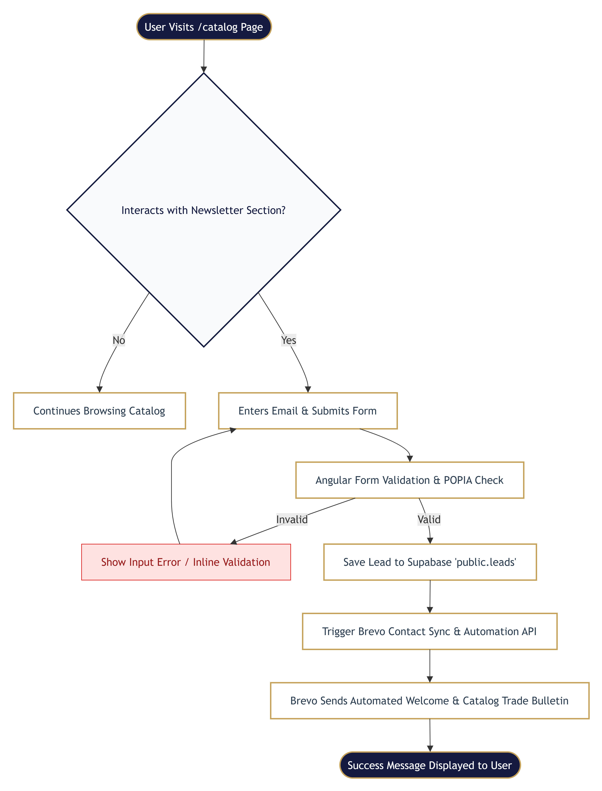

sequenceDiagram
    autonumber
    actor User as Funeral Director (Visitor)
    participant UI as Angular UI (/catalog)
    participant Edge as Supabase Edge Function / API
    participant DB as Supabase DB (public.leads)
    participant Brevo as Brevo (Sendinblue) API

    User->>UI: Enters email & accepts POPIA consent
    UI->>UI: Client-side validation (regex, required)
    UI->>Edge: POST /api/newsletter-subscribe {email, source: 'catalog'}
    
    Edge->>DB: Check if email exists in public.leads
    alt Email Already Exists
        DB-->>Edge: Record found
        Edge-->>UI: 200 OK {status: 'already_subscribed'}
        UI-->>User: "You're already on our trade list! Check your inbox."
    else New Lead
        Edge->>DB: INSERT INTO public.leads (email, source, lead_magnet)
        DB-->>Edge: Record created (id: UUID)
        
        Edge->>Brevo: POST /v3/contacts (Add to List + Trigger Template)
        Brevo-->>Edge: 201 Created (contact_id)
        
        Edge->>DB: UPDATE public.leads SET brevo_contact_id, email_sent = true
        Edge-->>UI: 200 OK {status: 'subscribed'}
        UI-->>User: Display Success Banner (.glass-card)
        Brevo--)User: Delivers "SAFS Catalog & Welcome Bulletin" Email
    end

    